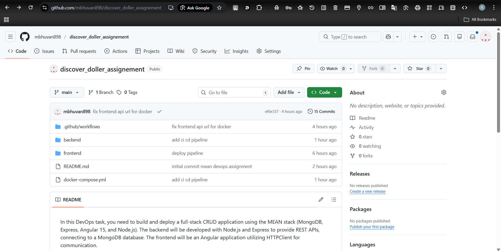
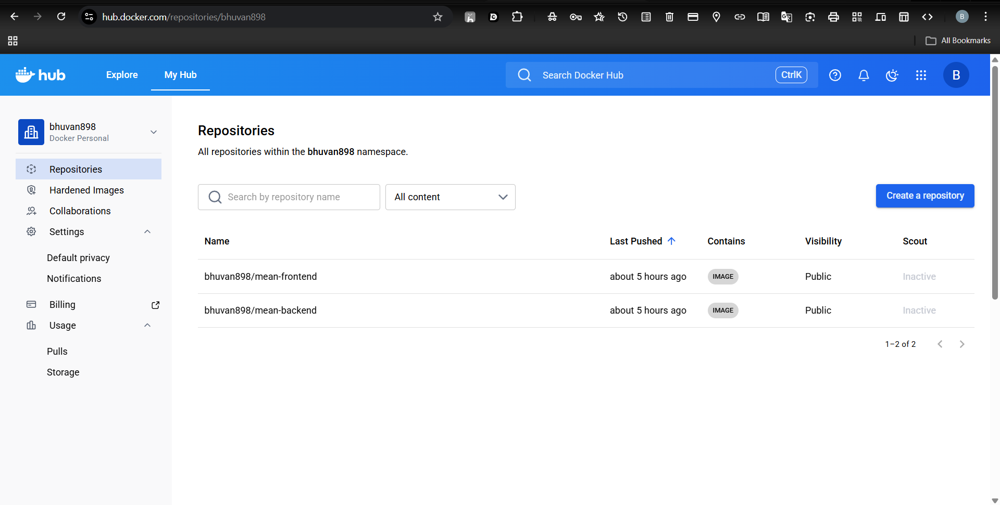
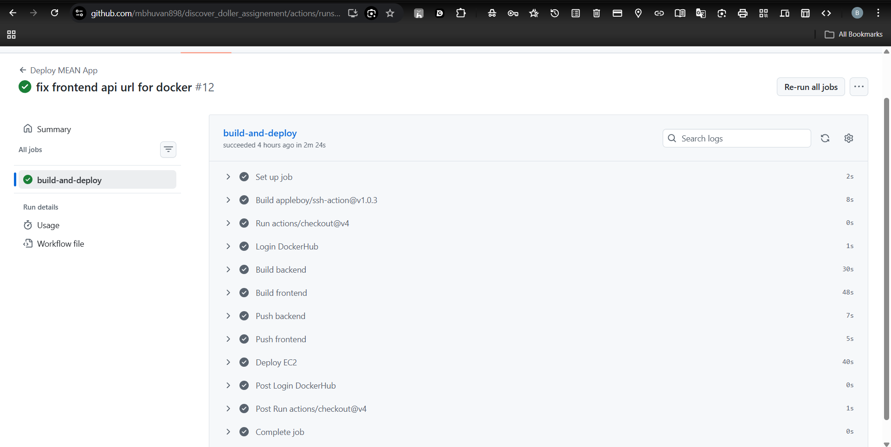
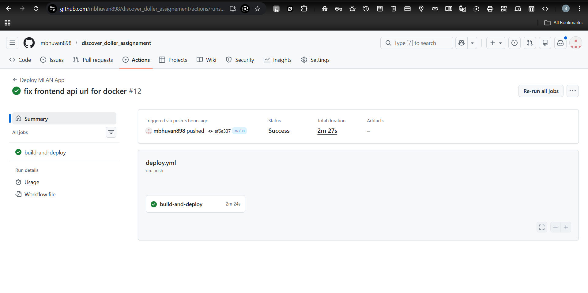
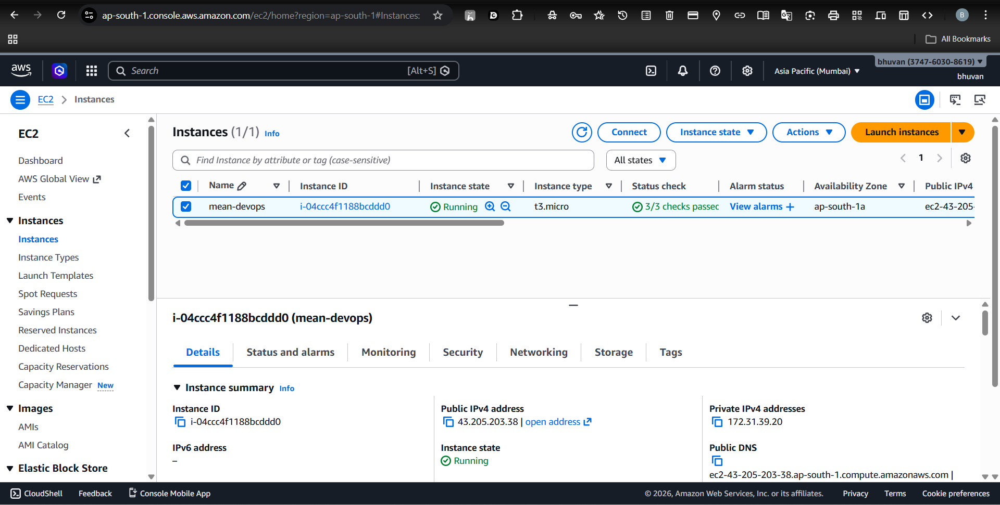
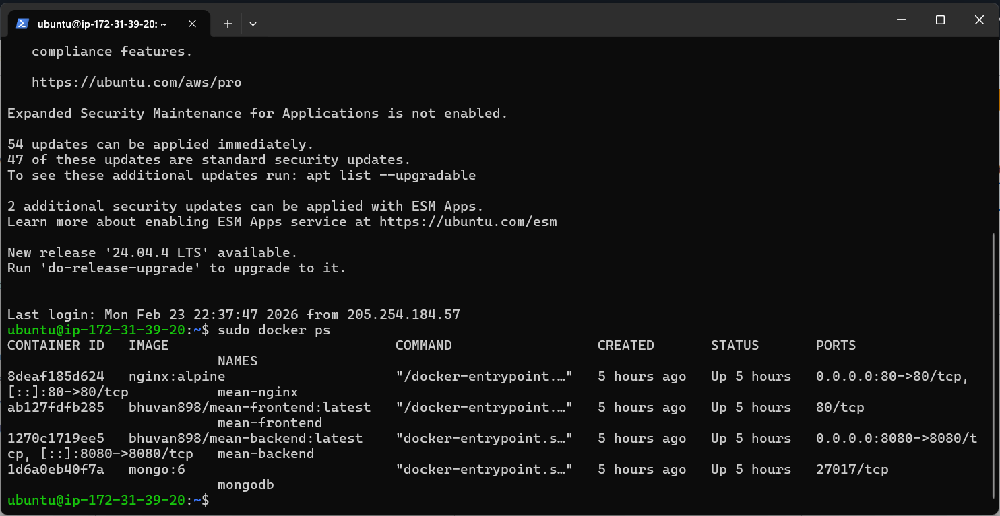
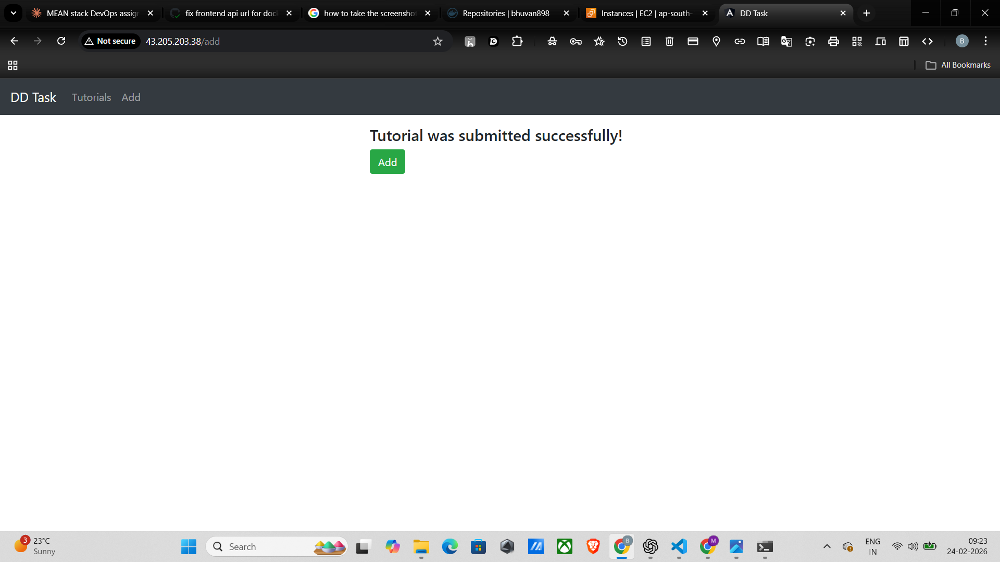

# 🚀 MEAN Stack CRUD App — DevOps Deployment

> Full-stack **MEAN (MongoDB, Express, Angular, Node.js)** application containerized with Docker, deployed on **AWS EC2 (Ubuntu)**, automated via **GitHub Actions CI/CD**, and served through an **Nginx reverse proxy** on port 80.

---

## 📌 Tech Stack

| Layer | Technology |
|---|---|
| Frontend | Angular |
| Backend | Node.js + Express.js |
| Database | MongoDB (Docker image) |
| Containerization | Docker + Docker Compose |
| CI/CD | GitHub Actions |
| Reverse Proxy | Nginx |
| Cloud | AWS EC2 (Ubuntu 22.04) |
| Image Registry | Docker Hub |

---

## 📂 Project Structure

```
mean-crud-app/
├── frontend/
│   ├── src/
│   ├── nginx.conf              # Angular in-container serving config
│   └── Dockerfile
├── backend/
│   ├── src/
│   └── Dockerfile
├── docker-compose.yml          # Multi-container orchestration
├── nginx.conf                  # Host-level reverse proxy config
├── .github/
│   └── workflows/
│       └── deploy.yml          # GitHub Actions pipeline
├── screenshots/                # All required screenshots
└── README.md
```

---

## 🐳 Dockerfiles

### Backend — `/backend/Dockerfile`

```dockerfile
FROM node:18-alpine
WORKDIR /app
COPY package*.json ./
RUN npm install
COPY . .
EXPOSE 8080
CMD ["node", "server.js"]
```

### Frontend — `/frontend/Dockerfile`

```dockerfile
# Stage 1: Build
FROM node:18-alpine AS build
WORKDIR /app
COPY package*.json ./
RUN npm install
COPY . .
RUN npm run build --prod

# Stage 2: Serve
FROM nginx:alpine
COPY --from=build /app/dist/frontend /usr/share/nginx/html
COPY nginx.conf /etc/nginx/conf.d/default.conf
EXPOSE 80
CMD ["nginx", "-g", "daemon off;"]
```

---

## 🗂️ Docker Compose — `docker-compose.yml`

```yaml
services:

  mongodb:
    image: mongo:6
    container_name: mongodb
    restart: always
    networks:
      - mean-net

  backend:
    image: bhuwan898/mean-backend:latest
    container_name: mean-backend
    restart: always
    environment:
      - MONGO_URL=mongodb://mongodb:27017/testdb
    depends_on:
      - mongodb
    ports:
      - "8080:8080"
    networks:
      - mean-net

  frontend:
    image: bhuwan898/mean-frontend:latest
    container_name: mean-frontend
    restart: always
    depends_on:
      - backend
    networks:
      - mean-net

  nginx:
    image: nginx:alpine
    container_name: mean-nginx
    restart: always
    ports:
      - "80:80"
    volumes:
      - ./nginx.conf:/etc/nginx/conf.d/default.conf
    depends_on:
      - frontend
      - backend
    networks:
      - mean-net

networks:
  mean-net:
    driver: bridge
```

---

## 🌐 Nginx Reverse Proxy — `nginx.conf`

```nginx
server {
  listen 80;

  location / {
    proxy_pass http://mean-frontend:80;
    proxy_set_header Host $host;
    proxy_set_header X-Real-IP $remote_addr;
  }

  location /api/ {
    proxy_pass http://mean-backend:8080/;
    proxy_set_header Host $host;
    proxy_set_header X-Real-IP $remote_addr;
  }
}
```

> All traffic enters on **port 80**. Nginx routes `/` to the Angular frontend and `/api/` to the Express backend — no direct port exposure needed.

---

## 🔁 CI/CD Pipeline — GitHub Actions

**File:** `.github/workflows/deploy.yml`

Pipeline triggers automatically on every push to the `main` branch.

### Pipeline Steps

```
Push to main
     │
     ▼
① Checkout Code
     │
     ▼
② Login to Docker Hub
     │
     ▼
③ Build Backend Image
④ Build Frontend Image
     │
     ▼
⑤ Push Backend → Docker Hub
⑥ Push Frontend → Docker Hub
     │
     ▼
⑦ SSH into EC2
     │
     ▼
⑧ Remove old containers + prune
⑨ Write nginx.conf + docker-compose.yml
⑩ Pull latest images
⑪ docker compose up -d
⑫ Verify running containers
```

### Full Workflow File

```yaml
name: Deploy MEAN App

on:
  push:
    branches: [ main ]

jobs:
  build-and-deploy:
    runs-on: ubuntu-latest

    steps:
      - uses: actions/checkout@v4

      - name: Login DockerHub
        uses: docker/login-action@v3
        with:
          username: ${{ secrets.DOCKER_USERNAME }}
          password: ${{ secrets.DOCKER_TOKEN }}

      - name: Build backend
        run: docker build -t ${{ secrets.DOCKER_USERNAME }}/mean-backend:latest ./backend

      - name: Build frontend
        run: docker build -t ${{ secrets.DOCKER_USERNAME }}/mean-frontend:latest ./frontend

      - name: Push backend
        run: docker push ${{ secrets.DOCKER_USERNAME }}/mean-backend:latest

      - name: Push frontend
        run: docker push ${{ secrets.DOCKER_USERNAME }}/mean-frontend:latest

      - name: Deploy to EC2
        uses: appleboy/ssh-action@v1.0.3
        with:
          host: ${{ secrets.EC2_HOST }}
          username: ubuntu
          key: ${{ secrets.EC2_SSH_KEY }}
          script: |
            sudo docker rm -f $(sudo docker ps -aq) || true
            sudo docker system prune -af || true
            mkdir -p ~/app && cd ~/app
            sudo docker compose pull
            sudo docker compose up -d
            sudo docker ps
```

### GitHub Secrets Required

| Secret | Description |
|---|---|
| `DOCKER_USERNAME` | Docker Hub username |
| `DOCKER_TOKEN` | Docker Hub access token |
| `EC2_HOST` | Public IP of EC2 instance |
| `EC2_SSH_KEY` | Full contents of `.pem` private key |

---

## ☁️ Cloud Infrastructure — AWS EC2

- **OS:** Ubuntu 22.04 LTS
- **Instance Type:** t2.micro (or higher)
- **Security Group Inbound Rules:**

| Port | Protocol | Purpose |
|---|---|---|
| 22 | TCP | SSH access |
| 80 | TCP | HTTP via Nginx |

### EC2 Setup Commands

```bash
# Update system
sudo apt update && sudo apt upgrade -y

# Install Docker
sudo apt install -y docker.io docker-compose-plugin
sudo systemctl enable docker
sudo systemctl start docker
sudo usermod -aG docker ubuntu
# Log out and back in after this step

# Verify installation
docker --version
docker compose version
```

---

## ▶️ Run Locally (Development)

```bash
# Clone the repo
git clone https://github.com/bhuwan898/mean-crud-app.git
cd mean-crud-app

# Build and start all containers
docker compose up -d --build

# Verify containers are running
docker ps
```

Then open: [http://localhost](http://localhost)

---

## 🏛️ Architecture Overview

```
Developer
    │
    │  git push → main
    ▼
GitHub Repository
    │
    │  Triggers GitHub Actions
    ▼
GitHub Actions Runner
    ├── Build mean-backend image
    ├── Build mean-frontend image
    └── Push both → Docker Hub
              │
              │  SSH + docker compose pull
              ▼
         AWS EC2 (Ubuntu VM)
              │
              ▼
     ┌──────────────────────────┐
     │   Docker Compose Stack   │
     │                          │
     │   Nginx :80 (Proxy)      │
     │    │            │        │
     │    ▼            ▼        │
     │  Angular    Express API  │
     │  Frontend   Backend      │
     │                 │        │
     │                 ▼        │
     │             MongoDB      │
     └──────────────────────────┘
              │
              ▼
           User
    http://EC2_PUBLIC_IP
```

---

## 📸 Screenshots

### 🔹 GitHub Repository Structure



> GitHub repository showing all project files including Dockerfiles, docker-compose.yml, nginx.conf, and CI/CD workflow.

---

### 🔹 Docker Hub — Images Pushed



> Docker Hub showing `bhuwan898/mean-backend` and `bhuwan898/mean-frontend` images successfully pushed with the `latest` tag.

---

### 🔹 GitHub Actions — CI/CD Build Logs



> GitHub Actions pipeline showing Docker image build and push steps for both frontend and backend completing successfully.

---

### 🔹 GitHub Actions — Pipeline Success



> Complete GitHub Actions workflow run showing all steps green — build, push, SSH deploy, and container restart.

---

### 🔹 AWS EC2 Instance Running



> AWS EC2 console showing the Ubuntu instance in running state with its public IP address.

---

### 🔹 EC2 SSH + Containers Running



> SSH session on EC2 showing output of `sudo docker ps` with all 4 containers up — mongodb, mean-backend, mean-frontend, mean-nginx.

---

### 🔹 Application UI — List Page


> Angular frontend accessible at `http://EC2_PUBLIC_IP` in the browser, served through Nginx on port 80.

---

### 🔹 CRUD Operation — Create / Update



> Application demonstrating a successful CRUD operation with data persisted in MongoDB.

---

## ✅ Assignment Checklist

| Requirement | Status |
|---|---|
| GitHub repository with complete code | ✅ |
| Dockerfile — Backend | ✅ |
| Dockerfile — Frontend | ✅ |
| Docker images pushed to Docker Hub | ✅ |
| MongoDB via Docker Compose | ✅ |
| Docker Compose deployment on EC2 | ✅ |
| GitHub Actions CI/CD pipeline | ✅ |
| Auto build + push on git push | ✅ |
| Auto deploy to EC2 on git push | ✅ |
| Nginx reverse proxy on port 80 | ✅ |
| Cloud infrastructure kept live | ✅ |
| README with screenshots | ✅ |

---

## 🔒 Important Note

As per assignment instructions, the **EC2 instance is kept available** and not terminated. The server may be stopped to save costs but can be restarted at any time for a **live CI/CD demonstration** in the next round.

---

## 👨‍💻 Author

**Bhuvan M**
DevOps Internship Assignment — Discover Dollar
February 2026